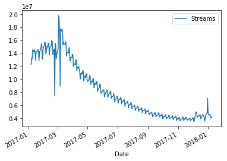
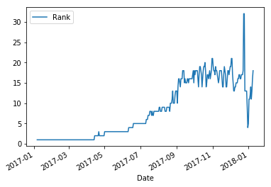

```python
#task one
import pandas as pd
import simplejson as json
#read in csv
df = pd.read_csv('data.csv',encoding='utf-8-sig',thousands=',');
#aggregate
df_new = df.groupby(['Track Name','Artist']).sum();
#top 10
df_new.nlargest(10,['Streams'])
```


<div>
<style scoped>
    .dataframe tbody tr th:only-of-type {
        vertical-align: middle;
    }

    .dataframe tbody tr th {
        vertical-align: top;
    }

    .dataframe thead th {
        text-align: right;
    }
</style>
<table border="1" class="dataframe">
  <thead>
    <tr style="text-align: right;">
      <th></th>
      <th></th>
      <th>Position</th>
      <th>Streams</th>
    </tr>
    <tr>
      <th>Track Name</th>
      <th>Artist</th>
      <th></th>
      <th></th>
    </tr>
  </thead>
  <tbody>
    <tr>
      <th>Shape of You</th>
      <th>Ed Sheeran</th>
      <td>301513</td>
      <td>2993988783</td>
    </tr>
    <tr>
      <th>Despacito - Remix</th>
      <th>Luis Fonsi</th>
      <td>477232</td>
      <td>1829621841</td>
    </tr>
    <tr>
      <th>Despacito (Featuring Daddy Yankee)</th>
      <th>Luis Fonsi</th>
      <td>816152</td>
      <td>1460802540</td>
    </tr>
    <tr>
      <th>Something Just Like This</th>
      <th>The Chainsmokers</th>
      <td>725122</td>
      <td>1386258295</td>
    </tr>
    <tr>
      <th>HUMBLE.</th>
      <th>Kendrick Lamar</th>
      <td>854060</td>
      <td>1311243745</td>
    </tr>
    <tr>
      <th>Unforgettable</th>
      <th>French Montana</th>
      <td>667424</td>
      <td>1289150890</td>
    </tr>
    <tr>
      <th>rockstar</th>
      <th>Post Malone</th>
      <td>127973</td>
      <td>1260181617</td>
    </tr>
    <tr>
      <th>I'm the One</th>
      <th>DJ Khaled</th>
      <td>548303</td>
      <td>1254196301</td>
    </tr>
    <tr>
      <th>It Ain't Me (with Selena Gomez)</th>
      <th>Kygo</th>
      <td>865603</td>
      <td>1190339348</td>
    </tr>
    <tr>
      <th>XO TOUR Llif3</th>
      <th>Lil Uzi Vert</th>
      <td>815686</td>
      <td>1171827725</td>
    </tr>
  </tbody>
</table>
</div>


```python
#task two
#aggregate
df_artist = df.groupby(['Artist']).sum();
#top 10
dfTop10Art = df_artist.nlargest(10,['Streams']).index.tolist()
dfTop10Art
```


    ['Ed Sheeran',
     'Drake',
     'The Chainsmokers',
     'Post Malone',
     'Kendrick Lamar',
     'Luis Fonsi',
     'J Balvin',
     'Calvin Harris',
     'Imagine Dragons',
     'DJ Khaled']


```python
#filter out top 10 artists
df_new = df[df['Artist'].isin(dfTop10Art)]
df_new = df_new.groupby(['Track Name','Artist'],as_index=False).sum();

# Create the dictionary that defines the order for sorting
sorterIndex = dict(zip(dfTop10Art,range(len(dfTop10Art))))

# Generate a rank column that will be used to sort
# the dataframe numerically
df_new['Rank'] = df_new['Artist'].map(sorterIndex)

# Here is the result asked with the lexicographic sort
# Result may be hard to analyze, so a second sorting is
# proposed next
## NOTE: 
## Newer versions of pandas use 'sort_value' instead of 'sort'
df_new.sort_values(['Rank','Streams'], \
        ascending = [True,False], inplace = True)
df_new.drop('Rank', 1, inplace = True)
df_new
```


<div>
<style scoped>
    .dataframe tbody tr th:only-of-type {
        vertical-align: middle;
    }

    .dataframe tbody tr th {
        vertical-align: top;
    }

    .dataframe thead th {
        text-align: right;
    }
</style>
<table border="1" class="dataframe">
  <thead>
    <tr style="text-align: right;">
      <th></th>
      <th>Track Name</th>
      <th>Artist</th>
      <th>Position</th>
      <th>Streams</th>
    </tr>
  </thead>
  <tbody>
    <tr>
      <th>176</th>
      <td>Shape of You</td>
      <td>Ed Sheeran</td>
      <td>301513</td>
      <td>2993988783</td>
    </tr>
    <tr>
      <th>155</th>
      <td>Perfect</td>
      <td>Ed Sheeran</td>
      <td>897147</td>
      <td>1008408812</td>
    </tr>
    <tr>
      <th>29</th>
      <td>Castle on the Hill</td>
      <td>Ed Sheeran</td>
      <td>889667</td>
      <td>950641030</td>
    </tr>
    <tr>
      <th>75</th>
      <td>Galway Girl</td>
      <td>Ed Sheeran</td>
      <td>783989</td>
      <td>895638000</td>
    </tr>
    <tr>
      <th>161</th>
      <td>Photograph</td>
      <td>Ed Sheeran</td>
      <td>1525708</td>
      <td>441132246</td>
    </tr>
    <tr>
      <th>85</th>
      <td>Happier</td>
      <td>Ed Sheeran</td>
      <td>735015</td>
      <td>396550634</td>
    </tr>
    <tr>
      <th>213</th>
      <td>Thinking Out Loud</td>
      <td>Ed Sheeran</td>
      <td>1604987</td>
      <td>378317823</td>
    </tr>
    <tr>
      <th>47</th>
      <td>Dive</td>
      <td>Ed Sheeran</td>
      <td>510163</td>
      <td>250391699</td>
    </tr>
    <tr>
      <th>159</th>
      <td>Perfect Duet (Ed Sheeran &amp; Beyoncé)</td>
      <td>Ed Sheeran</td>
      <td>76337</td>
      <td>211662492</td>
    </tr>
    <tr>
      <th>229</th>
      <td>What Do I Know?</td>
      <td>Ed Sheeran</td>
      <td>301625</td>
      <td>184236454</td>
    </tr>
    <tr>
      <th>141</th>
      <td>New Man</td>
      <td>Ed Sheeran</td>
      <td>234726</td>
      <td>165061869</td>
    </tr>
    <tr>
      <th>97</th>
      <td>How Would You Feel (Paean)</td>
      <td>Ed Sheeran</td>
      <td>309755</td>
      <td>158975388</td>
    </tr>
    <tr>
      <th>203</th>
      <td>Supermarket Flowers</td>
      <td>Ed Sheeran</td>
      <td>327270</td>
      <td>142213824</td>
    </tr>
    <tr>
      <th>15</th>
      <td>Barcelona</td>
      <td>Ed Sheeran</td>
      <td>225593</td>
      <td>130094807</td>
    </tr>
    <tr>
      <th>140</th>
      <td>Nancy Mulligan</td>
      <td>Ed Sheeran</td>
      <td>176048</td>
      <td>102351367</td>
    </tr>
    <tr>
      <th>88</th>
      <td>Hearts Don't Break Around Here</td>
      <td>Ed Sheeran</td>
      <td>160660</td>
      <td>94452753</td>
    </tr>
    <tr>
      <th>60</th>
      <td>Eraser</td>
      <td>Ed Sheeran</td>
      <td>144089</td>
      <td>88679551</td>
    </tr>
    <tr>
      <th>17</th>
      <td>Bibia Be Ye Ye</td>
      <td>Ed Sheeran</td>
      <td>126187</td>
      <td>75939105</td>
    </tr>
    <tr>
      <th>174</th>
      <td>Save Myself</td>
      <td>Ed Sheeran</td>
      <td>128230</td>
      <td>68764853</td>
    </tr>
    <tr>
      <th>177</th>
      <td>Shape of You (Latin Remix) [feat. Zion &amp; Lennox]</td>
      <td>Ed Sheeran</td>
      <td>180719</td>
      <td>34355823</td>
    </tr>
    <tr>
      <th>102</th>
      <td>I See Fire</td>
      <td>Ed Sheeran</td>
      <td>240254</td>
      <td>33374939</td>
    </tr>
    <tr>
      <th>181</th>
      <td>Shape of You - Stormzy Remix</td>
      <td>Ed Sheeran</td>
      <td>28529</td>
      <td>20779295</td>
    </tr>
    <tr>
      <th>206</th>
      <td>Tenerife Sea</td>
      <td>Ed Sheeran</td>
      <td>121875</td>
      <td>16897317</td>
    </tr>
    <tr>
      <th>208</th>
      <td>The A Team</td>
      <td>Ed Sheeran</td>
      <td>95988</td>
      <td>15096376</td>
    </tr>
    <tr>
      <th>50</th>
      <td>Don't</td>
      <td>Ed Sheeran</td>
      <td>76366</td>
      <td>11382067</td>
    </tr>
    <tr>
      <th>179</th>
      <td>Shape of You - Acoustic</td>
      <td>Ed Sheeran</td>
      <td>51559</td>
      <td>7349968</td>
    </tr>
    <tr>
      <th>178</th>
      <td>Shape of You (Major Lazer Remix) [feat. Nyla &amp;...</td>
      <td>Ed Sheeran</td>
      <td>41819</td>
      <td>6141094</td>
    </tr>
    <tr>
      <th>160</th>
      <td>Perfect Symphony (Ed Sheeran &amp; Andrea Bocelli)</td>
      <td>Ed Sheeran</td>
      <td>20864</td>
      <td>5400717</td>
    </tr>
    <tr>
      <th>79</th>
      <td>Give Me Love</td>
      <td>Ed Sheeran</td>
      <td>35504</td>
      <td>5051937</td>
    </tr>
    <tr>
      <th>76</th>
      <td>Galway Girl - Martin Jensen Remix</td>
      <td>Ed Sheeran</td>
      <td>42009</td>
      <td>4445160</td>
    </tr>
    <tr>
      <th>...</th>
      <td>...</td>
      <td>...</td>
      <td>...</td>
      <td>...</td>
    </tr>
    <tr>
      <th>237</th>
      <td>Yesterday</td>
      <td>Imagine Dragons</td>
      <td>9155</td>
      <td>1856645</td>
    </tr>
    <tr>
      <th>41</th>
      <td>Dancing In The Dark</td>
      <td>Imagine Dragons</td>
      <td>4854</td>
      <td>929413</td>
    </tr>
    <tr>
      <th>148</th>
      <td>On Top Of The World</td>
      <td>Imagine Dragons</td>
      <td>8341</td>
      <td>571052</td>
    </tr>
    <tr>
      <th>218</th>
      <td>Thunder / Young Dumb &amp; Broke (with Khalid) - M...</td>
      <td>Imagine Dragons</td>
      <td>4211</td>
      <td>500732</td>
    </tr>
    <tr>
      <th>227</th>
      <td>Warriors</td>
      <td>Imagine Dragons</td>
      <td>27124</td>
      <td>383634</td>
    </tr>
    <tr>
      <th>216</th>
      <td>Thunder (With K.Flay) - Official Remix</td>
      <td>Imagine Dragons</td>
      <td>257</td>
      <td>79939</td>
    </tr>
    <tr>
      <th>232</th>
      <td>Whatever It Takes - Jorgen Odegard Remix</td>
      <td>Imagine Dragons</td>
      <td>303</td>
      <td>15976</td>
    </tr>
    <tr>
      <th>184</th>
      <td>Shots - Broiler Remix</td>
      <td>Imagine Dragons</td>
      <td>1140</td>
      <td>9497</td>
    </tr>
    <tr>
      <th>110</th>
      <td>It's Time</td>
      <td>Imagine Dragons</td>
      <td>177</td>
      <td>4009</td>
    </tr>
    <tr>
      <th>217</th>
      <td>Thunder - Live/Acoustic</td>
      <td>Imagine Dragons</td>
      <td>132</td>
      <td>3062</td>
    </tr>
    <tr>
      <th>104</th>
      <td>I'm the One</td>
      <td>DJ Khaled</td>
      <td>548303</td>
      <td>1254196301</td>
    </tr>
    <tr>
      <th>234</th>
      <td>Wild Thoughts</td>
      <td>DJ Khaled</td>
      <td>492755</td>
      <td>899312362</td>
    </tr>
    <tr>
      <th>219</th>
      <td>To the Max</td>
      <td>DJ Khaled</td>
      <td>33545</td>
      <td>31286677</td>
    </tr>
    <tr>
      <th>53</th>
      <td>Don't Quit</td>
      <td>DJ Khaled</td>
      <td>40986</td>
      <td>22337446</td>
    </tr>
    <tr>
      <th>183</th>
      <td>Shining</td>
      <td>DJ Khaled</td>
      <td>40015</td>
      <td>17265613</td>
    </tr>
    <tr>
      <th>147</th>
      <td>On Everything</td>
      <td>DJ Khaled</td>
      <td>2714</td>
      <td>2836293</td>
    </tr>
    <tr>
      <th>106</th>
      <td>Iced Out My Arms</td>
      <td>DJ Khaled</td>
      <td>1589</td>
      <td>1675466</td>
    </tr>
    <tr>
      <th>101</th>
      <td>I Love You so Much</td>
      <td>DJ Khaled</td>
      <td>666</td>
      <td>1455389</td>
    </tr>
    <tr>
      <th>55</th>
      <td>Down for Life</td>
      <td>DJ Khaled</td>
      <td>1363</td>
      <td>1198808</td>
    </tr>
    <tr>
      <th>98</th>
      <td>I Can't Even Lie</td>
      <td>DJ Khaled</td>
      <td>1102</td>
      <td>1152628</td>
    </tr>
    <tr>
      <th>109</th>
      <td>It's Secured</td>
      <td>DJ Khaled</td>
      <td>949</td>
      <td>1120711</td>
    </tr>
    <tr>
      <th>130</th>
      <td>Major Bag Alert</td>
      <td>DJ Khaled</td>
      <td>1298</td>
      <td>652026</td>
    </tr>
    <tr>
      <th>145</th>
      <td>Nobody</td>
      <td>DJ Khaled</td>
      <td>326</td>
      <td>345069</td>
    </tr>
    <tr>
      <th>1</th>
      <td>(Intro) I'm so Grateful</td>
      <td>DJ Khaled</td>
      <td>482</td>
      <td>277571</td>
    </tr>
    <tr>
      <th>167</th>
      <td>Pull a Caper</td>
      <td>DJ Khaled</td>
      <td>292</td>
      <td>235606</td>
    </tr>
    <tr>
      <th>82</th>
      <td>Good Man</td>
      <td>DJ Khaled</td>
      <td>302</td>
      <td>227563</td>
    </tr>
    <tr>
      <th>230</th>
      <td>Whatever</td>
      <td>DJ Khaled</td>
      <td>365</td>
      <td>211116</td>
    </tr>
    <tr>
      <th>207</th>
      <td>That Range Rover Came With Steps</td>
      <td>DJ Khaled</td>
      <td>366</td>
      <td>210753</td>
    </tr>
    <tr>
      <th>71</th>
      <td>For Free</td>
      <td>DJ Khaled</td>
      <td>200</td>
      <td>143765</td>
    </tr>
    <tr>
      <th>49</th>
      <td>Do You Mind</td>
      <td>DJ Khaled</td>
      <td>3928</td>
      <td>83096</td>
    </tr>
  </tbody>
</table>
<p>245 rows × 4 columns</p>
</div>


```python
#task 3
#filter out Dec data
df_Dec = df.loc[(df['Date'] > '2017-11-30') & (df['Date'] < '2018-01-01')]
#open json file
with open('C:\\Program Files (x86)\\Apache Software Foundation\\Apache2.2\\htdocs\\codingTest\\countries.json', encoding='utf-8') as datafile:
    country = json.load(datafile)
#map region id into continent
new_dict = {v[0].lower():v[1]['continent'] for v in country.items()}
df_Dec['Continent'] = df_Dec['Region'].map(new_dict)

# SA
df_new = df_Dec.loc[df_Dec['Continent'].isin(['SA'])]
df_new = df_new.groupby(['Track Name','Artist','Continent'],as_index=False).sum();
df_new.drop('Continent', axis=1, inplace=True)
df_new.nlargest(10,['Streams'])

```

    C:\Users\HP\Anaconda3\lib\site-packages\ipykernel_launcher.py:9: SettingWithCopyWarning: 
    A value is trying to be set on a copy of a slice from a DataFrame.
    Try using .loc[row_indexer,col_indexer] = value instead
    
    See the caveats in the documentation: http://pandas.pydata.org/pandas-docs/stable/indexing.html#indexing-view-versus-copy
      if __name__ == '__main__':
    


<div>
<style scoped>
    .dataframe tbody tr th:only-of-type {
        vertical-align: middle;
    }

    .dataframe tbody tr th {
        vertical-align: top;
    }

    .dataframe thead th {
        text-align: right;
    }
</style>
<table border="1" class="dataframe">
  <thead>
    <tr style="text-align: right;">
      <th></th>
      <th>Track Name</th>
      <th>Artist</th>
      <th>Position</th>
      <th>Streams</th>
    </tr>
  </thead>
  <tbody>
    <tr>
      <th>294</th>
      <td>Downtown</td>
      <td>Anitta</td>
      <td>3752</td>
      <td>24552969</td>
    </tr>
    <tr>
      <th>1052</th>
      <td>Échame La Culpa</td>
      <td>Luis Fonsi</td>
      <td>2091</td>
      <td>24536523</td>
    </tr>
    <tr>
      <th>994</th>
      <td>Vai malandra (feat. Tropkillaz e DJ Yuri Martins)</td>
      <td>Anitta</td>
      <td>4458</td>
      <td>19796363</td>
    </tr>
    <tr>
      <th>233</th>
      <td>Corazón</td>
      <td>Maluma</td>
      <td>4462</td>
      <td>19525970</td>
    </tr>
    <tr>
      <th>837</th>
      <td>Sensualidad</td>
      <td>Bad Bunny</td>
      <td>786</td>
      <td>19120900</td>
    </tr>
    <tr>
      <th>240</th>
      <td>Criminal</td>
      <td>Natti Natasha</td>
      <td>825</td>
      <td>18427097</td>
    </tr>
    <tr>
      <th>417</th>
      <td>Havana</td>
      <td>Camila Cabello</td>
      <td>9926</td>
      <td>15654155</td>
    </tr>
    <tr>
      <th>654</th>
      <td>New Rules</td>
      <td>Dua Lipa</td>
      <td>8903</td>
      <td>15472698</td>
    </tr>
    <tr>
      <th>300</th>
      <td>Déjala Que Vuelva (feat. Manuel Turizo)</td>
      <td>Piso 21</td>
      <td>1137</td>
      <td>15357243</td>
    </tr>
    <tr>
      <th>833</th>
      <td>Se Preparó</td>
      <td>Ozuna</td>
      <td>1560</td>
      <td>15108884</td>
    </tr>
  </tbody>
</table>
</div>


```python
# NA
df_new = df_Dec.loc[df_Dec['Continent'].isin(['NA'])]
df_new = df_new.groupby(['Track Name','Artist','Continent'],as_index=False).sum();
df_new.drop('Continent', axis=1, inplace=True)
df_new.nlargest(10,['Streams'])
```


<div>
<style scoped>
    .dataframe tbody tr th:only-of-type {
        vertical-align: middle;
    }

    .dataframe tbody tr th {
        vertical-align: top;
    }

    .dataframe thead th {
        text-align: right;
    }
</style>
<table border="1" class="dataframe">
  <thead>
    <tr style="text-align: right;">
      <th></th>
      <th>Track Name</th>
      <th>Artist</th>
      <th>Position</th>
      <th>Streams</th>
    </tr>
  </thead>
  <tbody>
    <tr>
      <th>1051</th>
      <td>rockstar</td>
      <td>Post Malone</td>
      <td>4426</td>
      <td>62265844</td>
    </tr>
    <tr>
      <th>368</th>
      <td>Gucci Gang</td>
      <td>Lil Pump</td>
      <td>9252</td>
      <td>40603607</td>
    </tr>
    <tr>
      <th>381</th>
      <td>Havana</td>
      <td>Camila Cabello</td>
      <td>6569</td>
      <td>33811360</td>
    </tr>
    <tr>
      <th>410</th>
      <td>I Fall Apart</td>
      <td>Post Malone</td>
      <td>15925</td>
      <td>32428856</td>
    </tr>
    <tr>
      <th>645</th>
      <td>No Limit</td>
      <td>G-Eazy</td>
      <td>8536</td>
      <td>30647154</td>
    </tr>
    <tr>
      <th>768</th>
      <td>Ric Flair Drip (&amp; Metro Boomin)</td>
      <td>Offset</td>
      <td>5221</td>
      <td>30549341</td>
    </tr>
    <tr>
      <th>40</th>
      <td>All I Want for Christmas Is You</td>
      <td>Mariah Carey</td>
      <td>16087</td>
      <td>30367655</td>
    </tr>
    <tr>
      <th>395</th>
      <td>Him &amp; I (with Halsey)</td>
      <td>G-Eazy</td>
      <td>15409</td>
      <td>29233567</td>
    </tr>
    <tr>
      <th>947</th>
      <td>Too Good At Goodbyes</td>
      <td>Sam Smith</td>
      <td>11504</td>
      <td>28804277</td>
    </tr>
    <tr>
      <th>138</th>
      <td>Candy Paint</td>
      <td>Post Malone</td>
      <td>10995</td>
      <td>28639843</td>
    </tr>
  </tbody>
</table>
</div>


```python
# AS
df_new = df_Dec.loc[df_Dec['Continent'].isin(['AS'])]
df_new = df_new.groupby(['Track Name','Artist','Continent'],as_index=False).sum();
df_new.drop('Continent', axis=1, inplace=True)
df_new.nlargest(10,['Streams'])
```


<div>
<style scoped>
    .dataframe tbody tr th:only-of-type {
        vertical-align: middle;
    }

    .dataframe tbody tr th {
        vertical-align: top;
    }

    .dataframe thead th {
        text-align: right;
    }
</style>
<table border="1" class="dataframe">
  <thead>
    <tr style="text-align: right;">
      <th></th>
      <th>Track Name</th>
      <th>Artist</th>
      <th>Position</th>
      <th>Streams</th>
    </tr>
  </thead>
  <tbody>
    <tr>
      <th>396</th>
      <td>Havana</td>
      <td>Camila Cabello</td>
      <td>931</td>
      <td>14704046</td>
    </tr>
    <tr>
      <th>1027</th>
      <td>Too Good At Goodbyes</td>
      <td>Sam Smith</td>
      <td>4237</td>
      <td>12151470</td>
    </tr>
    <tr>
      <th>753</th>
      <td>Perfect</td>
      <td>Ed Sheeran</td>
      <td>4838</td>
      <td>12126620</td>
    </tr>
    <tr>
      <th>1117</th>
      <td>Wolves</td>
      <td>Selena Gomez</td>
      <td>1467</td>
      <td>11745050</td>
    </tr>
    <tr>
      <th>691</th>
      <td>New Rules</td>
      <td>Dua Lipa</td>
      <td>2092</td>
      <td>11535430</td>
    </tr>
    <tr>
      <th>1083</th>
      <td>What Lovers Do (feat. SZA)</td>
      <td>Maroon 5</td>
      <td>3003</td>
      <td>10880513</td>
    </tr>
    <tr>
      <th>755</th>
      <td>Perfect Duet (Ed Sheeran &amp; Beyoncé)</td>
      <td>Ed Sheeran</td>
      <td>4071</td>
      <td>9004183</td>
    </tr>
    <tr>
      <th>576</th>
      <td>Let Me Go (with Alesso, Florida Georgia Line &amp;...</td>
      <td>Hailee Steinfeld</td>
      <td>6519</td>
      <td>8279975</td>
    </tr>
    <tr>
      <th>1154</th>
      <td>Young Dumb &amp; Broke</td>
      <td>Khalid</td>
      <td>9608</td>
      <td>8241744</td>
    </tr>
    <tr>
      <th>291</th>
      <td>Dusk Till Dawn - Radio Edit</td>
      <td>ZAYN</td>
      <td>4987</td>
      <td>8202373</td>
    </tr>
  </tbody>
</table>
</div>


```python
# OC
df_new = df_Dec.loc[df_Dec['Continent'].isin(['OC'])]
df_new = df_new.groupby(['Track Name','Artist','Continent'],as_index=False).sum();
df_new.drop('Continent', axis=1, inplace=True)
df_new.nlargest(10,['Streams'])
```


<div>
<style scoped>
    .dataframe tbody tr th:only-of-type {
        vertical-align: middle;
    }

    .dataframe tbody tr th {
        vertical-align: top;
    }

    .dataframe thead th {
        text-align: right;
    }
</style>
<table border="1" class="dataframe">
  <thead>
    <tr style="text-align: right;">
      <th></th>
      <th>Track Name</th>
      <th>Artist</th>
      <th>Position</th>
      <th>Streams</th>
    </tr>
  </thead>
  <tbody>
    <tr>
      <th>516</th>
      <td>rockstar</td>
      <td>Post Malone</td>
      <td>163</td>
      <td>8014407</td>
    </tr>
    <tr>
      <th>190</th>
      <td>I Fall Apart</td>
      <td>Post Malone</td>
      <td>160</td>
      <td>7703310</td>
    </tr>
    <tr>
      <th>164</th>
      <td>Havana</td>
      <td>Camila Cabello</td>
      <td>327</td>
      <td>6514283</td>
    </tr>
    <tr>
      <th>390</th>
      <td>Silence</td>
      <td>Marshmello</td>
      <td>380</td>
      <td>6421820</td>
    </tr>
    <tr>
      <th>243</th>
      <td>Let You Down</td>
      <td>NF</td>
      <td>463</td>
      <td>6232183</td>
    </tr>
    <tr>
      <th>502</th>
      <td>Wolves</td>
      <td>Selena Gomez</td>
      <td>706</td>
      <td>5594006</td>
    </tr>
    <tr>
      <th>487</th>
      <td>What Lovers Do (feat. SZA)</td>
      <td>Maroon 5</td>
      <td>670</td>
      <td>5401333</td>
    </tr>
    <tr>
      <th>512</th>
      <td>Young Dumb &amp; Broke</td>
      <td>Khalid</td>
      <td>768</td>
      <td>5395800</td>
    </tr>
    <tr>
      <th>301</th>
      <td>New Rules</td>
      <td>Dua Lipa</td>
      <td>741</td>
      <td>5355194</td>
    </tr>
    <tr>
      <th>241</th>
      <td>Let Me Go (with Alesso, Florida Georgia Line &amp;...</td>
      <td>Hailee Steinfeld</td>
      <td>919</td>
      <td>5172326</td>
    </tr>
  </tbody>
</table>
</div>


```python
# EU
df_new = df_Dec.loc[df_Dec['Continent'].isin(['EU'])]
df_new = df_new.groupby(['Track Name','Artist','Continent'],as_index=False).sum();
df_new.drop('Continent', axis=1, inplace=True)
df_new.nlargest(10,['Streams'])
```


<div>
<style scoped>
    .dataframe tbody tr th:only-of-type {
        vertical-align: middle;
    }

    .dataframe tbody tr th {
        vertical-align: top;
    }

    .dataframe thead th {
        text-align: right;
    }
</style>
<table border="1" class="dataframe">
  <thead>
    <tr style="text-align: right;">
      <th></th>
      <th>Track Name</th>
      <th>Artist</th>
      <th>Position</th>
      <th>Streams</th>
    </tr>
  </thead>
  <tbody>
    <tr>
      <th>3822</th>
      <td>rockstar</td>
      <td>Post Malone</td>
      <td>3860</td>
      <td>55770638</td>
    </tr>
    <tr>
      <th>142</th>
      <td>All I Want for Christmas Is You</td>
      <td>Mariah Carey</td>
      <td>12275</td>
      <td>50133586</td>
    </tr>
    <tr>
      <th>1203</th>
      <td>Havana</td>
      <td>Camila Cabello</td>
      <td>9157</td>
      <td>46376741</td>
    </tr>
    <tr>
      <th>1838</th>
      <td>Last Christmas</td>
      <td>Wham!</td>
      <td>17740</td>
      <td>42710558</td>
    </tr>
    <tr>
      <th>2546</th>
      <td>Perfect Duet (Ed Sheeran &amp; Beyoncé)</td>
      <td>Ed Sheeran</td>
      <td>13932</td>
      <td>40131931</td>
    </tr>
    <tr>
      <th>1891</th>
      <td>Let You Down</td>
      <td>NF</td>
      <td>16495</td>
      <td>37070183</td>
    </tr>
    <tr>
      <th>3736</th>
      <td>Wolves</td>
      <td>Selena Gomez</td>
      <td>12810</td>
      <td>37040316</td>
    </tr>
    <tr>
      <th>2281</th>
      <td>New Rules</td>
      <td>Dua Lipa</td>
      <td>16533</td>
      <td>36052946</td>
    </tr>
    <tr>
      <th>2544</th>
      <td>Perfect</td>
      <td>Ed Sheeran</td>
      <td>17300</td>
      <td>35176113</td>
    </tr>
    <tr>
      <th>2730</th>
      <td>River (feat. Ed Sheeran)</td>
      <td>Eminem</td>
      <td>3971</td>
      <td>33752057</td>
    </tr>
  </tbody>
</table>
</div>


```python
# task 4
#filter out Shape of You
df_new = df.loc[df['Track Name'].isin(['Shape of You'])]
df_new = df_new.groupby(['Artist','Track Name','Date']).sum()
df_new = df_new.reset_index()
#change date format
df_new['Date'] = pd.to_datetime(df_new['Date'], format='%Y-%m-%d')
#plot
df_new.plot( x = 'Date',y='Streams')
```


    <matplotlib.axes._subplots.AxesSubplot at 0x156868fa320>





```python
#grregate
df_new = df.groupby(['Date','Track Name','Artist']).sum()
df_new = df_new.reset_index()
#calculate rank
df_new['Rank'] = df_new.groupby('Date')['Streams'].rank(ascending=False)
df_new = df_new.loc[df_new['Track Name']=='Shape of You']
#change date format
df_new['Date'] = pd.to_datetime(df_new['Date'], format='%Y-%m-%d')
#plot
df_new.plot(x='Date',y='Rank')
```


    <matplotlib.axes._subplots.AxesSubplot at 0x156868856a0>




